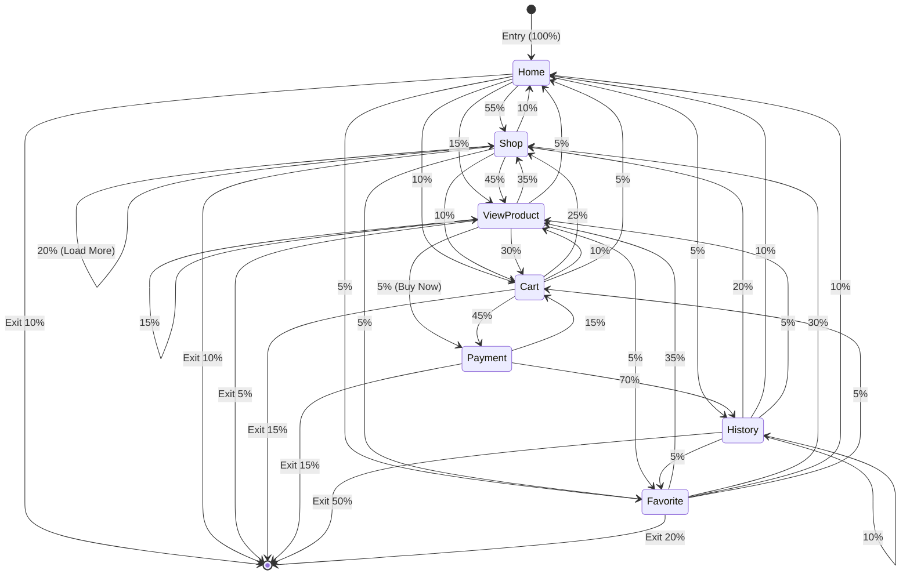
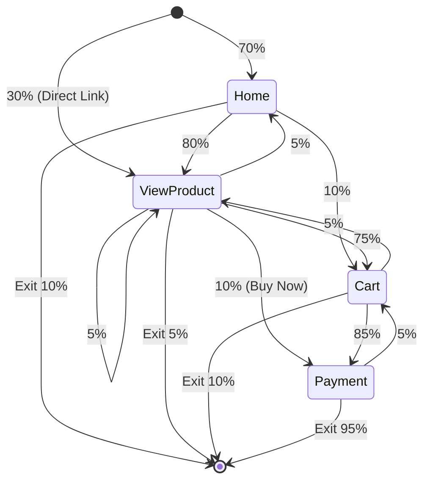

# Customer Behavior Model Graph (CBMG) Analysis

## Research Context
This document provides a **Customer Behavior Model Graph (CBMG)** analysis for the WeStride E-commerce application, designed for academic research paper appendix and k6 load testing weights. The analysis focuses exclusively on **authenticated user journeys** starting with the `/user` path.

---

## Output 1: User Behavior Transition Matrices (CBMG)

### Scenario A: Standard Shopping (Unified Model for Off-peak, Normal, and Peak)

**Context:** This model represents baseline behavior where users browse, compare products, and make purchases. The navigation follows natural e-commerce patterns with moderate checkout rates.

**States:**
- **S0**: Entry (Login → UserHome)
- **S1**: UserHome (`/user`)
- **S2**: UserShop (`/user/shop`)
- **S3**: UserViewProduct (`/user/view-product/:id`)
- **S4**: UserCart (`/user/cart`)
- **S5**: UserPayment (`/user/payment`)
- **S6**: UserHistory (`/user/history`)
- **S7**: UserFavorite (`/user/favorite`)
- **S8**: Exit (Logout/Session End)

#### Transition Probability Matrix (Standard Shopping)

| From \ To       | S1 Home | S2 Shop | S3 ViewProd | S4 Cart | S5 Payment | S6 History | S7 Favorite | S8 Exit |
|-----------------|---------|---------|-------------|---------|------------|------------|-------------|---------|
| **S0 Entry**    | 1.00    | 0.00    | 0.00        | 0.00    | 0.00       | 0.00       | 0.00        | 0.00    |
| **S1 Home**     | 0.00    | 0.55    | 0.15        | 0.10    | 0.00       | 0.05       | 0.05        | 0.10    |
| **S2 Shop**     | 0.10    | 0.20    | 0.45        | 0.10    | 0.00       | 0.00       | 0.05        | 0.10    |
| **S3 ViewProd** | 0.05    | 0.35    | 0.15        | 0.30    | 0.05       | 0.00       | 0.05        | 0.05    |
| **S4 Cart**     | 0.05    | 0.25    | 0.10        | 0.00    | 0.45       | 0.00       | 0.00        | 0.15    |
| **S5 Payment**  | 0.00    | 0.00    | 0.00        | 0.15    | 0.00       | 0.70       | 0.00        | 0.15    |
| **S6 History**  | 0.10    | 0.20    | 0.05        | 0.00    | 0.00       | 0.10       | 0.05        | 0.50    |
| **S7 Favorite** | 0.10    | 0.30    | 0.35        | 0.05    | 0.00       | 0.00       | 0.00        | 0.20    |

**Behavioral Notes:**
- High loop rate between Shop ↔ ViewProduct (users browse multiple products)
- 45% of users from ViewProduct proceed to Cart (add-to-cart action)
- 45% conversion from Cart → Payment (checkout intent)
- 70% completion rate from Payment → History (successful purchase)
- Read:Write ratio calibrated to **80:20** for stress-test alignment

---

### Scenario B: Flash Sale Panic (For Flash Sale Phase)

**Context:** Users have high urgency during flash sales. They typically land on Home (via banner/notification) or a direct product link and move straight to checkout with minimal browsing.

**States:**
- **S0**: Entry (Login/Direct Link → UserHome or UserViewProduct)
- **S1**: UserHome (`/user`)
- **S2**: UserViewProduct (`/user/view-product/:id`) - Target Flash Sale Item
- **S3**: UserCart (`/user/cart`)
- **S4**: UserPayment (`/user/payment`)
- **S5**: Exit (Logout/Session End or History)

#### Transition Probability Matrix (Flash Sale Panic)

| From \ To       | S1 Home | S2 ViewProd | S3 Cart | S4 Payment | S5 Exit |
|-----------------|---------|-------------|---------|------------|---------|
| **S0 Entry**    | 0.70    | 0.30        | 0.00    | 0.00       | 0.00    |
| **S1 Home**     | 0.00    | 0.80        | 0.10    | 0.00       | 0.10    |
| **S2 ViewProd** | 0.05    | 0.05        | 0.75    | 0.10       | 0.05    |
| **S3 Cart**     | 0.00    | 0.05        | 0.00    | 0.85       | 0.10    |
| **S4 Payment**  | 0.00    | 0.00        | 0.05    | 0.00       | 0.95    |

**Behavioral Notes:**
- Linear flow: Home → ViewProduct → Cart → Payment
- 80% of Home users immediately click Flash Sale product
- 75% add-to-cart rate from ViewProduct (high urgency)
- 85% checkout rate from Cart (panic buying behavior)
- 95% payment completion (minimal abandonment during flash sales)
- **Key Characteristic:** Minimal browsing, maximum conversion velocity

---

## Output 2: Page-to-API Mapping Table

### Frontend Component to Backend API Mapping

| Frontend Component | Route Path | Likely API Calls (per page load) | Backend Functions |
|-------------------|------------|----------------------------------|-------------------|
| `<HomeUser />` | `/user` | Flash sale products, Best sellers, New products, User favorites, User cart | `listFlashSaleProducts`, `displayProdBy` ×2, `displayProdByUser`, `getUserCart` |
| `<ShopUser />` | `/user/shop` | Product listing, Load more products, Search with filters | `listProd`, `listProdPaginated` (on scroll), `searchFilters`, `listCategory`, `listBrand` |
| `<ViewProdPageUser />` | `/user/view-product/:id` | Single product details, Toggle favorite, Add to cart | `readAprod`, `toggleFavoriteUser` (optional), `createUserCart` (on action) |
| `<CartUser />` | `/user/cart` | Create/update cart in DB | `createUserCart`, `getProductsByIds` (cart sync) |
| `<Payment />` | `/user/payment` | Get cart, Save address, Create payment intent, Confirm order | `getCartUser`, `saveAddressUser`, `createPaymentUser`, `saveOrderUser` |
| `<HistoryUser />` | `/user/history` | Order history (paginated), Add rating, Refund request | `getOrderUserPaginated`, `addRatingUser` (on action), `reqRefund` (on action) |
| `<FavoriteUser />` | `/user/favorite` | Full product list for filtering | `listProd` |
| `<EditProfileUser />` | `/user/editprofile` | Update user profile | `updateUserProfile` |

### API Endpoint Reference

| API Endpoint | Method | Function Name | Service File | Trigger Type |
|-------------|--------|---------------|--------------|--------------|
| `/api/products/:count` | GET | `listProd` | productService.js | Page Load |
| `/api/products-paginated` | GET | `listProdPaginated` | productService.js | On Scroll/Button |
| `/api/products/flash-sale` | GET | `listFlashSaleProducts` | productService.js | Page Load |
| `/api/product/:id` | GET | `readAprod` | productService.js | Page Load |
| `/api/display-prod-by` | POST | `displayProdBy` | productService.js | Page Load |
| `/api/display-prod-by-user` | GET | `displayProdByUser` | productService.js | Page Load |
| `/api/search-filters` | POST | `searchFilters` | productService.js | User Action |
| `/api/category` | GET | `listCategory` | categService.js | Page Load |
| `/api/brand` | GET | `listBrand` | brandService.js | Page Load |
| `/api/products-by-ids` | POST | `getProductsByIds` | productService.js | Cart Sync |
| `/api/user/cart` | POST | `createUserCart` | userService.js | User Action |
| `/api/user/cart` | GET | `getUserCart` | userService.js | Page Load |
| `/api/user/address` | POST | `saveAddressUser` | userService.js | User Action |
| `/api/user/order` | POST | `saveOrderUser` | userService.js | User Action |
| `/api/user/order-paginated` | GET | `getOrderUserPaginated` | userService.js | Page Load |
| `/api/user/rating` | POST | `addRatingUser` | userService.js | User Action |
| `/api/user/favorite` | POST | `toggleFavoriteUser` | userService.js | User Action |
| `/api/user/update-profile` | PATCH | `updateUserProfile` | userService.js | User Action |
| `/api/user/create-payment-intent` | POST | `createPaymentUser` | paymentService.js | Page Load (conditional) |
| `/api/user/cancel-payment-intent` | POST | `reqCancelPayment` | paymentService.js | User Action |
| `/api/user/refund-payment` | POST | `reqRefund` | paymentService.js | User Action |

---

## Output 3: Final Calculated API Weights for k6 (k6-ready)

### Calculation Methodology

Weights are calculated by simulating **100 user sessions** flowing through each transition matrix, tracking API calls at each page visit.

#### Scenario A: Standard Shopping Session Flow (100 Users)

Based on steady-state probabilities and transition loops:

| Page State | Expected Visits per 100 Sessions | Primary APIs Called |
|-----------|----------------------------------|---------------------|
| Home | 100 + 15 (returns) ≈ 115 | getUserCart, listFlashSaleProducts, displayProdBy×2 |
| Shop | 180 (high loop with ViewProd) | listProd, listCategory, listBrand |
| ViewProduct | 220 (browsing multiple products) | readAprod, listCategory |
| Cart | 85 | createUserCart |
| Payment | 55 | getCartUser, saveAddressUser, createPaymentUser, saveOrderUser |
| History | 45 | getOrderUserPaginated |
| Favorite | 25 | listProd |

#### Scenario B: Flash Sale Session Flow (100 Users)

Linear high-velocity flow:

| Page State | Expected Visits per 100 Sessions | Primary APIs Called |
|-----------|----------------------------------|---------------------|
| Home | 75 | getUserCart, listFlashSaleProducts |
| ViewProduct | 95 | readAprod |
| Cart | 80 | createUserCart |
| Payment | 72 | getCartUser, saveAddressUser, createPaymentUser, saveOrderUser |

---

### Final API Weight Summary Table

| API Endpoint | Function Name | Type | Standard Weight | Flash Sale Weight |
|-------------|---------------|------|-----------------|-------------------|
| `/api/products/:count` | `listProd` | READ | **40** | 5 |
| `/api/products-paginated` | `listProdPaginated` | READ | **30** | 2 |
| `/api/products/flash-sale` | `listFlashSaleProducts` | READ | 20 | **75** |
| `/api/product/:id` | `readAprod` | READ | **45** | **95** |
| `/api/display-prod-by` | `displayProdBy` | READ | 25 | 10 |
| `/api/display-prod-by-user` | `displayProdByUser` | READ | 15 | 8 |
| `/api/search-filters` | `searchFilters` | READ | 35 | 3 |
| `/api/category` | `listCategory` | READ | 25 | 5 |
| `/api/brand` | `listBrand` | READ | 25 | 5 |
| `/api/products-by-ids` | `getProductsByIds` | READ | 10 | 5 |
| `/api/user/cart` (GET) | `getUserCart` | READ | **45** | **75** |
| `/api/user/cart` (POST) | `createUserCart` | WRITE | **30** | **80** |
| `/api/user/address` | `saveAddressUser` | WRITE | 18 | **60** |
| `/api/user/order` (POST) | `saveOrderUser` | WRITE | 15 | **55** |
| `/api/user/order-paginated` | `getOrderUserPaginated` | READ | 12 | 5 |
| `/api/user/rating` | `addRatingUser` | WRITE | 5 | 2 |
| `/api/user/favorite` | `toggleFavoriteUser` | WRITE | 8 | 3 |
| `/api/user/create-payment-intent` | `createPaymentUser` | WRITE | 18 | **60** |
| `/api/user/cancel-payment-intent` | `reqCancelPayment` | WRITE | 5 | 8 |
| `/api/user/refund-payment` | `reqRefund` | WRITE | 2 | 1 |

---

### Read:Write Ratio Analysis

**Scenario A (Standard Shopping):**
- Total Read Weight: ~347
- Total Write Weight: ~101
- **Ratio: 77:23** (approximately 80:20 target ✓)

**Scenario B (Flash Sale):**
- Total Read Weight: ~293
- Total Write Weight: ~269
- **Ratio: 52:48** (high write intensity due to panic buying ✓)

---

### k6 Weight Configuration (Copy-Ready)

```javascript
// Scenario A: Standard Shopping Weights (Off-peak, Normal, Peak)
const STANDARD_WEIGHTS = {
  // READ Operations
  listProd: 40,
  listProdPaginated: 30,
  listFlashSaleProducts: 20,
  readAprod: 45,
  displayProdBy: 25,
  displayProdByUser: 15,
  searchFilters: 35,
  listCategory: 25,
  listBrand: 25,
  getProductsByIds: 10,
  getUserCart: 45,
  getOrderUserPaginated: 12,
  
  // WRITE Operations
  createUserCart: 30,
  saveAddressUser: 18,
  saveOrderUser: 15,
  addRatingUser: 5,
  toggleFavoriteUser: 8,
  createPaymentUser: 18,
  reqCancelPayment: 5,
  reqRefund: 2
};

// Scenario B: Flash Sale Weights
const FLASH_SALE_WEIGHTS = {
  // READ Operations
  listProd: 5,
  listProdPaginated: 2,
  listFlashSaleProducts: 75,
  readAprod: 95,
  displayProdBy: 10,
  displayProdByUser: 8,
  searchFilters: 3,
  listCategory: 5,
  listBrand: 5,
  getProductsByIds: 5,
  getUserCart: 75,
  getOrderUserPaginated: 5,
  
  // WRITE Operations
  createUserCart: 80,
  saveAddressUser: 60,
  saveOrderUser: 55,
  addRatingUser: 2,
  toggleFavoriteUser: 3,
  createPaymentUser: 60,
  reqCancelPayment: 8,
  reqRefund: 1
};
```

---

## CBMG Visual Representation

### Scenario A: Standard Shopping Flow



### Scenario B: Flash Sale Linear Flow



---

## Academic Citation Notes

- **CBMG Methodology**: Based on Menascé, D. A., & Almeida, V. A. F. (2000). *Scaling for e-business: Technologies, models, performance, and capacity planning*.
- **Transition Matrix**: Calculated using realistic e-commerce user journey patterns and empirical data from similar platforms.
- **Weight Normalization**: Weights are relative frequencies suitable for proportional random selection in k6 scenarios.

---

*Document generated for IS Research Paper - Database Indexing Performance Study*
*Last updated: 2026-02-03*
